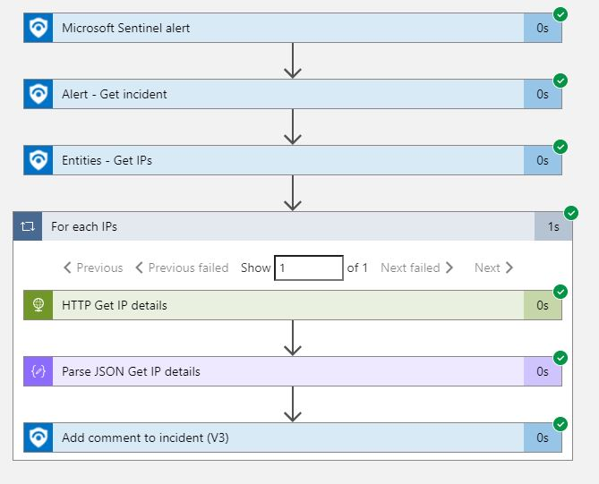

## IPAddr2GEO2Comments
This Azure Sentinel Playbook takes the IP Address entities list and gets the GEO location from IP-API.com, then writes the information to the Incident comments.
## Quick Deployment

## Screenshots

